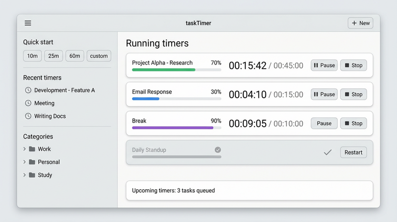

# taskTimer

**taskTimer** is a kitchen and task timer for Linux. The **recommended way to use it** is the **standalone GTK application** (`gjs main.js`): a normal desktop window with lists, quick start, system notifications, optional tray icon, and JSON configuration—so it runs on **GNOME, KDE, Xfce, and other desktops**, not only GNOME Shell.

This repository also contains a **GNOME Shell extension** (`taskTimer@CryptoD`) for users who prefer a panel indicator; it shares the same timer logic but targets the Shell UI and GSettings.

---

## Screenshots

<p align="center">
  
</p>

*Main window: quick start, presets, running timers, and toolbar actions. Actual theme follows your system or in-app **Theme** setting (Preferences → General).*

---

## Standalone app — feature overview

| Area | What you get |
|------|----------------|
| **Timers** | Preset timers, one-click quick presets, “Quick start” entry (natural language / durations), running list with snooze, pause, ±30s, stop |
| **Desktop integration** | `Gio.Notification` alerts when a timer ends; optional **system tray** (StatusNotifier / legacy status icon); **minimize to tray**; **autostart on login** (XDG autostart `.desktop`) |
| **Look & feel** | **Theme**: System / Light / Dark; display toggles for labels, time, progress, end time |
| **Data** | Settings and timers stored under **`~/.config/tasktimer/`** and **`~/.local/share/tasktimer/`** (JSON); portable and easy to back up |
| **Sound** | Alarm sounds via GStreamer; volume hints when the mixer is available |
| **Shortcuts** | In-app shortcuts when the window has focus; see **Preferences** and `BUILD.md` for details |

---

## Installation (standalone)

### 1. Dependencies

You need **GJS**, **GTK 3** (GObject Introspection), and **GStreamer** GI bindings. Typical package names:

- **Debian / Ubuntu:** `gjs`, `gir1.2-gtk-3.0`, `gir1.2-gstreamer-1.0` (plus `gir1.2-gio-2.0` as pulled in by GTK)
- **Fedora:** `gjs`, `gtk3`, `gstreamer1-plugins-base` + introspection packages
- **Arch:** `gjs`, `gtk3`, `gst-plugins-base-libs`

Optional: **libayatana-appindicator** or **libappindicator** GI bindings for a better tray on many desktops. See `bin/check-deps.sh` and **[BUILD.md](BUILD.md)** for a full contributor-oriented list.

### Developer tooling (optional)

For contributors running JavaScript tooling (ESLint, Playwright E2E shell), install **Node.js 22 LTS** and use the repository `package.json` (tooling only; the app does not depend on npm at runtime).

### 2. From source (this repository)

```bash
git clone https://github.com/CryptoD/taskTimer.git
cd taskTimer
bin/check-deps.sh --runtime
gjs main.js
```

To install a **`.desktop`** entry for your session (optional), use your distro’s “create launcher” flow, or run from a terminal / app grid after packaging.

### 3. AppImage (release builds)

If your project publishes AppImages, they are produced with `make appimage` (see **[BUILD.md](BUILD.md)**). Install the downloaded `.AppImage`, `chmod +x`, and run it.

---

## Running the application

```bash
gjs main.js              # main window
gjs main.js --minimized  # start hidden; use tray if available
gjs main.js --version
gjs main.js --help
```

| Flag | Short | Meaning |
|------|--------|---------|
| `--help` | `-h` | Print usage and exit (no UI). |
| `--version` | `-v` | Print name and version and exit. |
| `--minimized` | — | Open with the main window hidden (tray only if supported). |
| `--test-notification` | — | Show a test notification once after startup (debugging). |

**Branding** (application ID, name, icon) is centralized in `platform/standalone/branding.js` and matches the **About** dialog and notifications.

**Autostart:** Preferences → **General** → **Start when you log in** writes `~/.config/autostart/tasktimer.desktop` (removed when turned off). Paths use absolute locations so login works regardless of current directory.

---

## Standalone vs GNOME Shell extension

| Topic | Standalone (`main.js`) | GNOME extension |
|--------|-------------------------|-----------------|
| **Where it runs** | Any desktop with GTK 3 + GJS | **GNOME Shell only** |
| **UI** | Full window + optional tray | **Panel indicator** + popup menus |
| **Settings storage** | **JSON** under `~/.config/tasktimer/` | **GSettings** / schema in `taskTimer@CryptoD` |
| **Global shortcuts** | **In-app** when the window is focused | Can use **Shell-global** accelerators (best on X11; Wayland has limits) |
| **Import / export settings** | Edit JSON or use files manually; **no** full import/export UI in standalone prefs | **Import/export** available in extension **Preferences** (when using `prefs.js`) |
| **Theme / menu width** | Window theme + GTK preferences; no Shell stylesheet | Shell **stylesheet** + **menu max width** for the panel menu |

Both paths share core timer code (`taskTimer@CryptoD/*`, `platform/standalone/*`). Pick one surface per session; mixing two installs is usually unnecessary.

---

## GNOME Shell extension (optional)

For users who want the **classic panel applet** only on GNOME Shell:

1. Copy `taskTimer@CryptoD` to `~/.local/share/gnome-shell/extensions/`
2. Compile schemas: `bash taskTimer@CryptoD/bin/compile_schemas.sh`
3. Restart Shell (e.g. log out/in) and enable the extension in **Extensions** or **extensions.gnome.org**

Details and packaging: **[BUILD.md](BUILD.md)**.

---

## Configuration paths (standalone)

| Data | Location |
|------|----------|
| User settings | `~/.config/tasktimer/config.json` |
| Timer persistence | `~/.local/share/tasktimer/timers.json` (and related) |
| Autostart | `~/.config/autostart/tasktimer.desktop` when enabled |

---

## Documentation

| Doc | Purpose |
|-----|---------|
| **[CHANGELOG.md](CHANGELOG.md)** | Release history, migration notes (extension ↔ standalone) |
| **[BUILD.md](BUILD.md)** | Build requirements, `make` targets, tests, AppImage, extension zip |
| **[CONTRIBUTING.md](CONTRIBUTING.md)** | How to report issues, run tests/lint, and submit pull requests |
| **[tests/TEST14-beta-coordination.md](tests/TEST14-beta-coordination.md)** | Beta AppImages, TEST 14 accessibility testing, feedback before stable releases |
| **[docs/dev/architecture.md](docs/dev/architecture.md)** | Entry points, modules, data; clarifies non-Go / non-web checklist items |
| **[docs/dev/checklist-mapping.md](docs/dev/checklist-mapping.md)** | Former long checklist IDs vs taskTimer (N/A vs quality bar here) |
| **[docs/dev/llm-context.md](docs/dev/llm-context.md)** | AI/LLM: paths that do not exist (`internal/server/router.go`, …); `main.js` vs `main.go` |
| **[docs/dev/deployment.md](docs/dev/deployment.md)** | How taskTimer is distributed; Docker image (`Dockerfile.api`) for smoke checks |
| **[e2e/README.md](e2e/README.md)** | Playwright + MSW browser E2E shell (`npm run test:e2e`; not the GTK UI) |
| `doc/` | Design notes and phase docs where present |
| `tests/*.md` | Manual test scenarios (tray, notifications, accessibility, etc.) |

---

## API (pagination contract)

This repository does **not** implement an HTTP API. The canonical pagination contract for list endpoints
(for the backend service repo) is documented here:

- **`docs/api/pagination-contract.md`**

---

## License

See [LICENSE](LICENSE).

## Contributing

Contributions are welcome. Start with **[CONTRIBUTING.md](CONTRIBUTING.md)** for issue/PR expectations, and **[BUILD.md](BUILD.md)** for dependencies, `make` targets, and running tests and lint locally.
