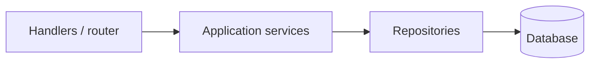
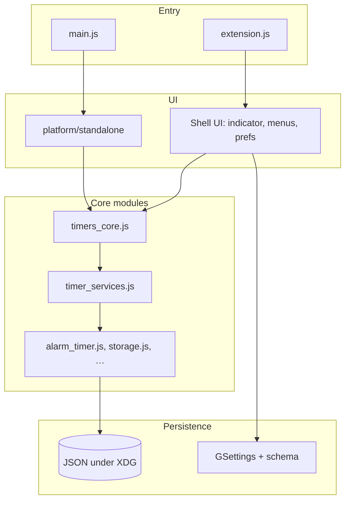

# Architecture (taskTimer)

This document describes **this repository** as it exists today. **taskTimer** is a **GJS + GTK** desktop timer with an optional **GNOME Shell extension**.

**Checklist templates** sometimes assume a **Go** layout (`internal/server`, `cmd/…`, background **jobs** started from `main`, HTTP **repos**). **None of that exists here.** This file documents the **actual** modules and directories. For N/A checklist rows, see the table under [Checklist items from other stacks](#checklist-items-from-other-stacks-not-applicable).

For packaging and CI, see [deployment.md](deployment.md) and [BUILD.md](../../BUILD.md). For the former long checklist, see [checklist-mapping.md](checklist-mapping.md).

---

## Entry points

| Surface | Entry | Role |
|--------|--------|------|
| **Standalone app** | [`main.js`](../../main.js) (repo root) | Parses CLI (`--help`, `--version`, …), runs `Gtk.Application`, loads UI from `platform/standalone/`, imports shared logic from `taskTimer@CryptoD/`. **Not** an HTTP server `main` and **not** a job scheduler—just the desktop process entry. |
| **GNOME Shell extension** | [`taskTimer@CryptoD/extension.js`](../../taskTimer@CryptoD/extension.js) | `enable()` / `disable()` hooks, panel indicator, Shell UI; uses the same shared JS modules for timers. |

There is **no** `internal/server` package, **no** `main.go`, and **no** central HTTP router.

---

## Dependency diagrams

Many runbooks sketch **HTTP handlers → service layer → database**. **taskTimer** has no SQL DB or HTTP stack; persistence is **JSON** (standalone) and **GSettings** (extension). The diagrams below contrast the **checklist shape** with **this codebase**.

### Reference: handlers → service → DB (typical backend; **not** in this repo)

### Actual: UI → timer core → persistence (**taskTimer**)

Standalone prefs and `config.js` read/write **JSON**; the extension path also uses **GSettings** for schema-backed settings.

---

## Repository layout (current)

Top-level areas (see also [README.md](../../README.md)):

| Path | Purpose |
|------|---------|
| **`main.js`**, **`config.js`**, **`context.js`**, **`i18n.js`**, **`app_version.js`** | Standalone bootstrap, paths, gettext, version metadata. |
| **`platform/interface.js`** | Abstract “platform” interfaces (tray, notifications, shortcuts, config). |
| **`platform/standalone/`** | GTK main window, preferences, tray providers, notifications, shortcuts—**standalone-only** UI. |
| **`taskTimer@CryptoD/`** | **Shared** timer core (`timers_core.js`, `settings.js`, `storage.js`, …), **plus** extension-only UI (`indicator.js`, `menus.js`, `extension.js`, `prefs.js`, …), schemas, icons, PO files. |
| **`tests/`** | GJS tests (`test*.js`) run by **`make test`**. |
| **`bin/`** | Maintainer scripts: dependency checks, lint helpers, packaging, version sync. |
| **`packaging/appimage/`** | AppImage AppDir, build scripts, metadata (see [BUILD.md](../../BUILD.md)). |
| **`docs/dev/`** | Developer docs (this file, deployment, checklist mapping). |
| **`doc/`** | Design notes, screenshots, phase docs. |
| **`e2e/`** | Playwright + MSW **browser shell** only—not GTK automation. |
| **`.github/workflows/`** | **`ci.yml`** — `make lint`, `make test`, `npm run lint`; **`e2e.yml`** — `npm run test:e2e`; **`release.yml`** — AppImage + GitHub Release on tags. |

**Version source of truth:** [`version.json`](../../version.json) (synced into extension metadata and AppStream via `make sync-version`).

---

## Shared timer logic vs surfaces

Shared modules live under **`taskTimer@CryptoD/`** (`timers_core.js`, `timer_services.js`, `alarm_timer.js`, `storage.js`, …). **Standalone** uses **JSON** on disk; **extension** uses **GSettings** where the schema is installed—**no** SQL repository or `db.go`.

---

## Data and configuration

| Mode | Storage |
|------|---------|
| **Standalone** | JSON under `~/.config/tasktimer/` and `~/.local/share/tasktimer/` (see [README.md](../../README.md)). |
| **Extension** | GSettings + compiled schema; see `taskTimer@CryptoD/schemas/`. |

---

## Testing and automation

| Layer | Command / location |
|-------|-------------------|
| GJS tests | `make test` → `tests/test*.js` |
| Shell / gettext | `make lint` → `bin/lint.sh`, `bin/check-deps.sh` |
| ESLint | `npm run lint` |
| Browser shell | `npm run test:e2e` → `e2e/` |

There is **no** `handlers_test.go` or Go test suite.

---

## Checklist items from other stacks (not applicable)

Automation templates sometimes mention:

| Checklist idea | In **this** repo |
|----------------|------------------|
| Handlers in `main.go`, DB in `db.go` | **Does not apply** — no Go backend. |
| `rateLimitMiddleware` on `POST /login` | **Does not apply** — no HTTP login API. |
| `handlers_test.go` (password reset happy path, expired token, …) | **Does not apply** — no Go handlers; no HTTP password reset. |
| `NewServer` / constructor-style wiring for an HTTP server | **Does not apply** — no Go `Server` type; startup is `gjs main.js` / `extension.js` loading GTK/Shell modules. |
| `GET /users` admin list with `limit`/`offset` in `internal/server/users.go` | **Does not apply** — no HTTP API, no `users.go`, no admin user listing. |
| Cross-user **task** access tests vs comments/attachments (`main_test.go`) | **Does not apply** — no Go `main_test.go`, no multi-user task API; tests are GJS `tests/test*.js`. |
| `frontend/src/...`, React lazy routes, `DataManager.test.js` | **Does not apply** — no React SPA in this tree. |
| `frontend/jest.config.cjs` with `collectCoverage: false` / CI coverage thresholds | **Does not apply** — no Jest frontend; JS tooling is ESLint + GJS tests (`make test`). |
| Overlapping **`.github/workflows/ci.yml`** and **`tests.yml`** both running **Go** tests | **Does not apply** — no `tests.yml` for Go; [`.github/workflows/ci.yml`](../../.github/workflows/ci.yml) runs `make lint` / `make test` (GJS) + npm lint; **[`e2e.yml`](../../.github/workflows/e2e.yml)** is Playwright only. |
| **`golangci-lint`** / **`staticcheck`** in CI | **Does not apply** — no Go code; shell + gettext via `make lint`, ESLint via `npm run lint`. |
| **OpenAPI** (`openapi.yaml` / Swagger) in repo root or `docs/` | **Does not apply** — no HTTP API to document; app is desktop GJS/GTK. |

If you need a **web** or **API** service alongside taskTimer, treat it as a **separate** project; this repository stays focused on the desktop/extension experience.
