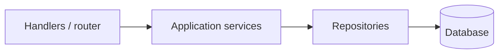
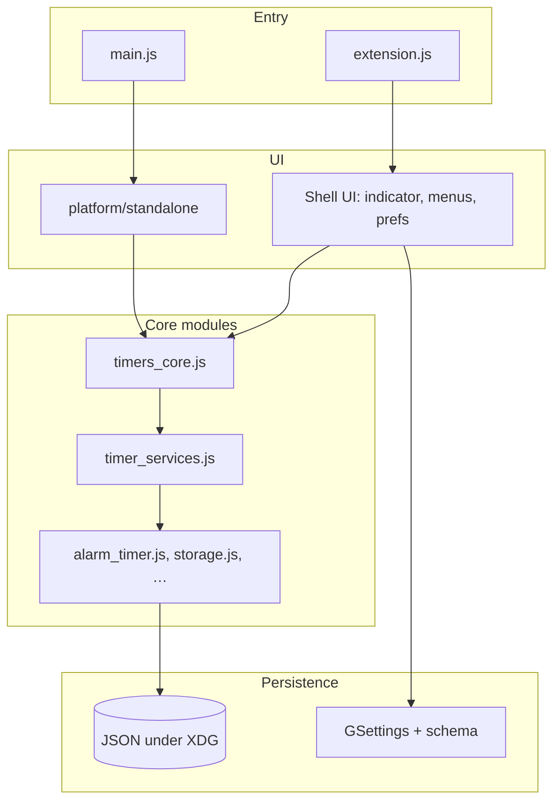

# Architecture (taskTimer)

This document is enough on its own to **build an accurate mental model** of the repository. You do **not** need a Go HTTP backend, **`internal/server/router.go`**, **`internal/service/`**, **`internal/db`**, SQLite, **`main.go`**, or a React **`frontend/`** tree—**none of those exist here**. If you assumed them from generic checklists, **ignore them** for this project.

---

## Done when (self-check)

After reading this file, you should be able to answer:

| Question | Short answer (spoilers—read below for detail) |
|----------|-----------------------------------------------|
| What runtime and UI stack? | **GJS** (JavaScript on SpiderMonkey) + **GTK 3** GObject Introspection; optional **GNOME Shell** extension UI (St/Clutter), not a web app. |
| How do you run two different UIs from one repo? | **Standalone:** `gjs main.js` → GTK under `platform/standalone/`. **Extension:** GNOME Shell loads `taskTimer@CryptoD/extension.js` → panel indicator + menus. |
| Where is “business logic” for timers? | Mostly **`taskTimer@CryptoD/`** (`timers_core.js`, `timer_services.js`, `alarm_timer.js`, …). |
| Where does data live? | **Standalone:** JSON files under XDG (`~/.config/tasktimer/`, `~/.local/share/tasktimer/`). **Extension:** **GSettings** + schema under `taskTimer@CryptoD/schemas/`. |

---

## Done when (thin `main` + no stray globals — GJS analogue)

Some checklists require: **no new globals**; **`main` is mostly wiring and `Run`**. This project has **`main.js`**, not `main.go`, and the event loop is **`Gtk.Application.run()`** (and Shell’s extension lifecycle for the extension)—**not** `http.ListenAndServe`.

| Intent | In taskTimer |
|--------|----------------|
| **Avoid new globals** | Prefer **`const` / `let`** at module top level and **`imports.*`** bindings. Do **not** introduce new **`globalThis.*`** (or ad-hoc `var` on the global object) for feature work. Follow existing patterns (e.g. gettext `_` in [`main.js`](../../main.js)). |
| **Thin entry + one “run”** | **[`main.js`](../../main.js)** should stay **bootstrap**: imports, CLI early exit (`--help` / `--version`), `Gtk.Application` construction, then **`app.run()`**. Substantive UI and timer behavior belong in **`platform/standalone/`** (e.g. `gtk_platform.js`) and **`taskTimer@CryptoD/`**, not large new blocks only in `main.js`. |

**Done when:** A change keeps **`main.js`** mostly **wiring** (imports, CLI, app creation, **`run()`**) and does **not** add unnecessary **global** surface; new logic lives in **modules** alongside existing code.

---

## Mental model in one minute

**taskTimer** is a **desktop** kitchen/task timer for Linux. All application code is **JavaScript** executed by **`gjs`**, using **GTK** for the standalone window and **GNOME Shell APIs** for the optional panel extension.

- **One shared core** (`taskTimer@CryptoD/`) implements timers, alarms, storage helpers, and settings abstractions.
- **Two UIs** sit on top: a **GTK** app (`platform/standalone/`) and/or a **Shell** extension UI (`indicator.js`, `menus.js`, `prefs.js`, …). Most users run **standalone**; the extension is for people who want a **panel** indicator on GNOME Shell only.
- **No server**: nothing listens on HTTP; there is no database server. **Persistence** is **files** (JSON) or **GSettings**, depending on the surface.
- **Tests** are **GJS scripts** in `tests/` plus **`make lint`** (gettext + shellcheck on shell scripts). **Node** (`npm run lint`, `npm run test:e2e`) is **tooling only**—ESLint and a Playwright+MSW **browser shell**, not the GTK app.

---

## Entry points (where execution starts)

| Surface | File | What happens |
|--------|------|----------------|
| **Standalone** | [`main.js`](../../main.js) at repo root | Parses CLI (`--help`, `--version`, `--minimized`, …), constructs `Gtk.Application`, loads windows and prefs from `platform/standalone/`, imports shared code from `taskTimer@CryptoD/`. |
| **GNOME Shell extension** | [`taskTimer@CryptoD/extension.js`](../../taskTimer@CryptoD/extension.js) | `enable()` / `disable()`; creates the panel indicator and wires Shell UI; uses the same shared timer modules. |

**Not** `main.go`, **not** HTTP route handlers, **not** a background job runner—just **desktop** processes.

---

## Dependency diagrams

External runbooks often assume **HTTP handlers → application services → DB**. **taskTimer** has **no** SQL database and **no** HTTP API. Persistence is **JSON** (standalone) and **GSettings** (extension).

### Reference stack (typical backend; **not** this repo)

### Actual stack (**taskTimer**)

Standalone prefs and [`config.js`](../../config.js) read/write **JSON**; extension preferences use **GSettings** where the schema is installed.

---

## Repository layout (current)

| Path | What to know |
|------|----------------|
| **`main.js`**, **`config.js`**, **`context.js`**, **`i18n.js`**, **`app_version.js`** | Standalone bootstrap, XDG paths, gettext, version string. |
| **`platform/interface.js`** | Small “platform” abstractions (tray, notifications, shortcuts, config). |
| **`platform/standalone/`** | **GTK-only**: main window, preferences window, tray, notifications, shortcuts. |
| **`taskTimer@CryptoD/`** | **Shared** timer engine + **extension-only** Shell UI (`indicator.js`, `menus.js`, `prefs.js`, …), schemas, icons, PO files, `audio_manager.js`, etc. |
| **`tests/`** | GJS tests (`test*.js`); **`make test`** runs them all. |
| **`bin/`** | Scripts: `check-deps.sh`, `lint.sh`, packaging, `sync-version.py`. |
| **`packaging/appimage/`** | AppImage AppDir and build; copies/syncs app files for the image. |
| **`docs/dev/`** | Developer docs (this file, deployment, checklist mapping, [`llm-context.md`](llm-context.md), [`js-complexity-baseline.md`](js-complexity-baseline.md), [`adr/`](adr/) for complexity exceptions). |
| **`doc/`** | Design notes, screenshots, phase write-ups. |
| **`e2e/`** | Playwright + MSW **browser** smoke tests only—not GTK. |
| **`.github/workflows/`** | **`ci.yml`** — `make lint`, `make test`, `npm run lint`; **`e2e.yml`** — `npm run test:e2e`; **`release.yml`** — AppImage + GitHub Release on version tags. |

**Version:** [`version.json`](../../version.json) is the source of truth; `make sync-version` updates extension metadata and AppStream.

---

## Target frontend-style structure (if a web `src/` is introduced)

This repository is **not** a React/Vite-style web frontend today, but some tooling checklists expect a feature-based `src/` layout. If we ever introduce a web-style `src/`, the target structure is:

- `src/features/<feature>/` — vertical slices (UI + state + helpers)
- `src/shared/` — shared UI primitives and utilities
- `src/app/` — app wiring (routes, providers, composition)

### Phase 1 migration (example)

We migrated one small, self-contained vertical slice to prove the layout without breaking imports:

- `src/features/quick-entry-fallback/quick_entry_fallback.js`
- Kept a compatibility shim at `platform/standalone/quick_entry_fallback.js` so existing `imports.platform.standalone.quick_entry_fallback` imports remain valid.

### Phase 2 (Kanban / calendar / reports)

These features do **not exist** in this repository (there is no Kanban board, calendar, or reports UI). Accordingly:

- There is no `components/` tree to police; feature UI lives under `platform/standalone/` (GTK) and `taskTimer@CryptoD/` (GNOME Shell extension).
- If a future web UI adds Kanban/calendar/reports, they should live under `src/features/` and any `components/` directory (if introduced) should be reserved for **shared UI primitives only**.

---

## Shared logic vs two surfaces

- **Timer logic** (running timers, alarms, parsing, storage helpers) lives under **`taskTimer@CryptoD/`**—used by **both** GTK and Shell.
- **GTK-specific** UI is under **`platform/standalone/`** only.
- **Shell-specific** UI is under **`taskTimer@CryptoD/`** (e.g. `indicator.js`, `menus.js`) and **`prefs.js`** for extension preferences.
- **Standalone** persists to **JSON** under `~/.config/tasktimer/` and `~/.local/share/tasktimer/` (see [README.md](../../README.md) for exact paths).
- **Extension** uses **GSettings** and **`taskTimer@CryptoD/schemas/`** when installed.

There is **no** shared SQL layer or `db.go`.

---

## Data and configuration

| Mode | Storage |
|------|---------|
| **Standalone** | JSON files under XDG (`~/.config/tasktimer/`, `~/.local/share/tasktimer/`). |
| **Extension** | GSettings + compiled schema in `taskTimer@CryptoD/schemas/`. |

---

## Transaction boundaries (atomic multi-step mutations)

Many backend-oriented checklists talk about DB transactions around multi-step mutations like
“create task + tags” or “delete task and related rows” or “bulk import”. **Those concepts are
N/A in this repository** because:

- There is **no Go backend** (`CreateTask`, `DeleteTask`, import handlers, DB transactions, etc. do not exist here).
- Persistence is **files (JSON)** and **GSettings**, not an RDBMS.

### What must be atomic in this repo

Within the desktop app, the closest equivalents are **timer list mutations** that must not leave the
user with partially-updated state:

- **Add/start quick timer**: create timer object → add to in-memory list → start → persist (best-effort)
- **Edit/delete preset**: update in-memory list → persist
- **Reorder presets/quick timers**: reorder in-memory list → persist

### Atomicity mechanism

- **In-memory state updates** are performed synchronously.
- **Persistence** is a best-effort JSON write (see `storage.js` and standalone settings provider). If a write fails,
  the app should remain usable and avoid crashing; UI may show an in-app banner when relevant.

---

## Background jobs extracted from `main` (backend pattern)

Some checklists refer to Go “background jobs” (goroutines) living under `internal/jobs` with `Start(ctx)` / `Stop()`
and taking `*db.Database` + config. This is **N/A** in this repository (no Go backend).

If you’re looking for that pattern, see `docs/dev/background-jobs.md` for the backend-repo outline.

---

## Testing and automation

| What | How |
|------|-----|
| GJS tests | `make test` → every `tests/test*.js` |
| gettext + shell scripts | `make lint` |
| JavaScript style | `npm run lint` (ESLint) |
| Browser-only shell | `npm run test:e2e` (Playwright + MSW in `e2e/`) |

There is **no** Go test suite (`handlers_test.go`, …).

---

## Checklist items from other stacks (not applicable)

Automation templates sometimes mention patterns that **do not apply** here:

| Checklist idea | In **this** repo |
|----------------|------------------|
| Handlers in `main.go`, DB in `db.go` | **N/A** — no Go backend. |
| `rateLimitMiddleware` on `POST /login` | **N/A** — no HTTP login API. |
| `handlers_test.go` (password reset, …) | **N/A** — no Go HTTP handlers. |
| **Explicit server / router constructor** (e.g. `NewServer`, `NewRouter`, `http.Server` wiring) | **N/A** — no HTTP listener or route table; process entry is **`gjs main.js`** (`Gtk.Application`) and **`taskTimer@CryptoD/extension.js`** (Shell extension). |
| **HTTP stack dependencies in one composition root** (e.g. `NewServer`, `NewHTTPServer` wiring DB + router + middleware) | **N/A** — there is **no** HTTP stack; nothing to construct or inject for a listener. Desktop deps are **system packages** (GTK, GJS, GStreamer—see [BUILD.md](../../BUILD.md)), not app-composed HTTP layers. |
| **`db.InitDB`**, **service** construction, **`server.SetupRouter`** behind one **typed constructor** shared by **`main`** and **tests** | **N/A** — no SQL `InitDB`, no Go services/router, no `main.go`/`main_test.go` split. **Tests** are **`tests/test*.js`** run by **`gjs`**; they do not bootstrap the same constructor as **`main.js`** because there is no shared HTTP/DB wiring layer. |
| **“Minimize diff in `main.go`”** / **“keep `SetupRouter` testable”** (AI/LLM Go refactors) | **N/A** — no **`main.go`**, no **`SetupRouter`**; see **[llm-context.md](llm-context.md)**. |
| **“No new globals; `main` is wiring + `Run`”** (Go) | **GJS analogue:** section **“Done when (thin `main` + no stray globals — GJS analogue)”** below — not `main.go` / `http.Server`. |
| `GET /users` in `internal/server/users.go` | **N/A** — no HTTP API. |
| Cross-user tasks in `main_test.go` | **N/A** — no multi-user Go API. |
| `frontend/src/...`, React tests | **N/A** — no React app. |
| `frontend/jest.config.cjs` / coverage gates | **N/A** — no Jest frontend. |
| React `useApi` hook / `fetchWithAuth` HTTP client extraction | **N/A** — no HTTP API client layer exists in this repo. |
| Domain hooks (`useTasks`, `useProjects`, …) | **N/A** — no React app/hooks layer exists in this repo. |
| Shrink `App.js` / extract `AppShell` | **N/A** — no React `App.js` exists in this repo; entry points are `main.js` (GTK) and `taskTimer@CryptoD/extension.js` (GNOME Shell). |
| Duplicate `ci.yml` + `tests.yml` for Go | **N/A** — workflows above are authoritative. |
| `golangci-lint` / `staticcheck` | **N/A** — no Go code. |
| **OpenAPI** in `docs/` | **N/A** — no HTTP API to document. |

---

## Further reading (optional)

Commands, dependencies, and release steps: **[BUILD.md](../../BUILD.md)**. Packaging and Docker: **[deployment.md](deployment.md)**. Long checklist mapping: **[checklist-mapping.md](checklist-mapping.md)**. AI/LLM path guardrails: **[llm-context.md](llm-context.md)**.
